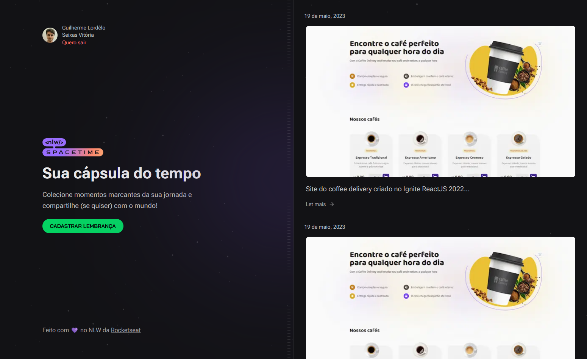

# NLW Spacetime - WEB

  

## Descrição

Aplicação de recordação de memórias, onde o usuário poderá adicionar à uma timeline textos, fotos e vídeos de acontecimentos marcantes da sua vida, organizados por mês e ano.

### Screenshot

### Tecnologias utilizadas:

-  Ícones: Lucide React

<!-- ### Links

-  Site hospedado: [Coffee Delivery](https://coffee-delivery-jade.vercel.app/) -->

### Próximas features
- Edição da memória
- Link para compartilhar memória
- Selecionar data da memória
- Layout responsivo